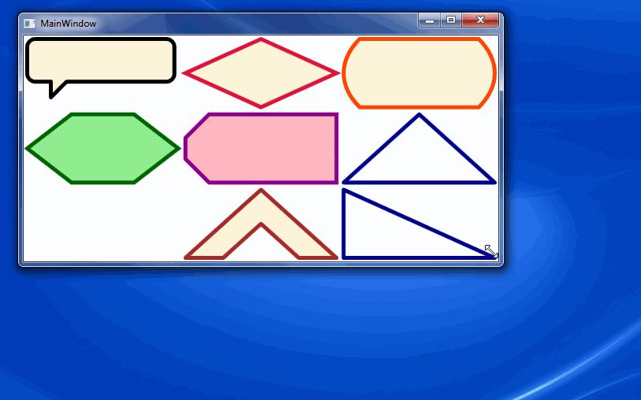

# Project Description
WPF Shapes is a small library of useful shape controls for WPF that resize nicely to the space available. Currently it includes:

* Hexagon
* Diamond
* Triangle
* Rounded Sides Rectangle
* Chevron
* Speech Bubble
* Label (Rectangle with top left and bottom left corners cut off)



# Usage
Add a reference to the WpfShapes DLL. Easiest way is [with NuGet](https://nuget.org/packages/WpfShapes/0.1).
Add a namespace directive to your XAML:

````xml
<Window ...
xmlns:shapes="clr-namespace:WpfShapes;assembly=WpfShapes">
````

Then you can declare shapes in XAML. For example the **diamond** shape:
````xml
<shapes:Diamond Stroke="Crimson" StrokeThickness="5" Fill="BlanchedAlmond" />
````

The **Label** shape has an optional CornerWidth property:
````xml
<shapes:Label Stroke="DarkMagenta" Fill="LightPink" StrokeThickness="5" Margin="2" />
````

The **Triangle** shape has an enumeration of compass points to specify which direction the triangle points:
````xml
<shapes:Triangle Stroke="DarkBlue" Fill="AliceBlue" StrokeThickness="5" Margin="2" TriangleOrientation="SW" />
````

# Contributing
I welcome any code contributions of new shapes or improvements to existing shapes. Just fork the repository and issue a pull request.
